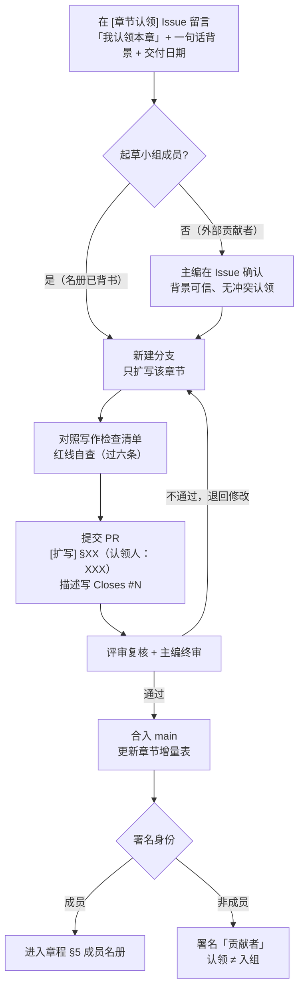

# LegalOPC 白皮书起草小组 · 贡献指南

感谢你对 LegalOPC 白皮书的兴趣。本仓库是开放共建的：欢迎一切来自一线法律人、法务、法学院与法律科技从业者的真实反馈。

---

## 一、共建方式（三选一或全选）

### 1. 反馈白皮书（最轻量）
- 阅读 `docs/white-paper.html`，就任何一节提交 Issue。
- 标题建议格式：`[白皮书] §02 定义部分：关于"责任不可委托"的表述建议`
- 反馈内容可以是：事实纠错、口径商榷、补充数据/案例、结构建议。

### 2. 参与讨论议题
- 共建发起手册（`community/co-build-handbook.html`）中列有"讨论议题清单"。
- 加入闭门讨论（15 人以内），每次围绕 5–7 个具体问题，产出分歧清单与共识点。

### 3. 担任章节主笔 / 评审 / 数据顾问
- 章节主笔：认领 `governance/writing-guide.md` §五 中某一章节，按写作指南扩写。
- 评审：对他人章节做红线复核与专业把关。
- 数据顾问：提供可标注来源的 SME 市场数据与案例。

---

## 二、写作红线（摘要，全文见 governance/writing-guide.md）

1. **AI 不是责任主体**——AI 做执行，法律人担责并签字。
2. **LegalOPC 是组织形态**，不是任何产品的上级，不称"旗下"。
3. **LegalOPC 不是行业级智能体 / 大模型**——它是运营法律智能体、兜底责任的人 + AI 主体。
4. **未定稿方法论不写入**——白皮书只写现在能对外说的事。
5. **SME 是 B 端真实付费市场**——OPC 创业者在 A 端（供给侧），不是 B 端付费客户。
6. **政策作背书，不作需求证据**。

术语口径（禁止词与替代写法）以写作指南 §四 为准。

---

## 三、提交流程（章节贡献者）

1. **认领章节**：在仓库 Issues 的 `[章节认领]` 列表中，找到想写的章节（#1–#9 对应章程 §2 章节增量表的 9 行），在评论区留言「我认领本章」+ 一句话背景 + 预计交付日期，即完成认领（先到先得）。
   - 一人一次只认领**一个章节**（章程 §6.1），完成后可再认领下一章；认领后 7 天无产出视为释放。
   - **非起草小组成员**：留言后需**主编在 Issue 下确认**（背景可信、无冲突认领）再开工；**认领不视为加入起草小组**，合入后署名「贡献者」，不进章程 §5 成员名册。
2. 新建分支（如 `section-03-capability-model`），只扩写**一个章节**，产出草稿。
3. 对照写作指南附录"写作检查清单"自查（过六条红线）。
4. 提交 PR，标题注明章节号与认领人（如 `[扩写] §03 能力模型（认领人：XXX）`），描述中写 `Closes #Issue编号` 关联认领 Issue；由评审复核、主编终审。
5. 合入后更新章程 §2「章节增量表」进度。

---

## 四、数据与案例纪律

- 所有数字、百分比、案例、引用**必须标注来源**。
- 估算数字明确标注"估算 / 约 / 据行业观察"。
- 真实案例脱敏或授权后使用；推演案例标注"基于典型场景推演"。
- **禁止**：编造公司名、交易金额、人物经历。

---

## 五、行为约定

- 共建 = 邀请一线的人一起把模糊的事谈清楚，**不是发布标准**。
- 不群发邀请；专家邀请一律 1 对 1。
- 让贡献可见、可署名；不预设结论、不抢功。

---

开始之前，建议先读一遍 `README.md` 与 `governance/writing-guide.md`。
